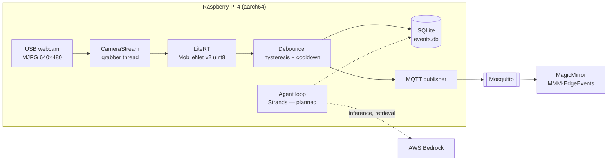

# pi-edge-ai

Real-time image classification on a Raspberry Pi 4, turned into a clean event
stream that other devices and an LLM agent can consume.

The Pi runs a quantised MobileNet on a USB webcam feed, collapses thousands of
per-frame predictions into a handful of meaningful events, stores them in
SQLite and publishes them over MQTT. The reasoning layer — an agent that
answers questions like *"what did the camera see this morning?"* — is being
built on AWS Bedrock, with the agent loop staying on the device.

The project is as much about **engineering the edge/cloud boundary** as about
the model: what runs where, what gets deployed, what keeps working when the
network is gone.

## Architecture



| Zone | Contents | How it gets there |
|---|---|---|
| Mac | everything | `git clone` |
| Git | everything except model weights and secrets | `git push` |
| Pi | `src/`, `models/`, `tests/`, runtime requirements | `make deploy` (rsync filter) |
| AWS | no files, API calls only | from the Pi at runtime |

## Highlights

- **One event per episode, not per frame.** A 15 FPS classifier would write
  over a million rows a day. The `Debouncer` needs a label to hold for several
  frames to open an episode, keeps it alive with a lower exit threshold
  (hysteresis), and closes it after a cooldown. It records the peak score and
  the true duration, including the confirmation window.
- **Hardware-free core, tested on the Mac.** Preprocessing, dequantisation,
  debouncing, the event store and the MQTT payloads are pure Python. OpenCV,
  LiteRT and paho are imported lazily, so the suite runs on an Intel Mac where
  LiteRT has no wheels; hardware tests are marked and run on the Pi.
- **Deployment boundary as code.** `scripts/deploy.sh` is an explicit rsync
  allow-list — what is not listed never reaches the device.
- **Built for long unattended runs.** Threaded capture so camera latency and
  inference overlap, SQLite in WAL mode with `synchronous=NORMAL` to spare the
  SD card, graceful shutdown on SIGTERM, model provenance on every row.
- **Decoupled consumers.** Events and live presence go out over MQTT with a
  versioned JSON schema, retained state and a Last Will, so a display knows
  both *what is in view* and *whether the Pi is alive*.

## Results

<!-- Fill in from `make bench-pi` before sharing the repo. -->

Median latency on a Raspberry Pi 4 B, 4 threads, XNNPACK, after warm-up:

| Model | Input | Size | Median | p95 | FPS |
|---|---|---|---|---|---|
| MobileNet v2 1.0 (uint8) | 224×224 | — | — | — | — |
| MobileNet v1 0.25 (uint8) | 128×128 | — | — | — | — |

## Hardware

| Component | Notes |
|---|---|
| Raspberry Pi 4 B | 64-bit Raspberry Pi OS (Trixie); `uname -m` must print `aarch64` |
| Power supply | official 5 V / 3 A recommended |
| Storage | microSD (A2) or USB 3 SSD, ≥ 16 GB free |
| USB webcam | any UVC camera that offers **MJPG** — with YUYV only, USB bandwidth caps 640×480 at 5–10 FPS |

## Quick start

On the Mac (Python ≥ 3.11):

```bash
make setup        # venv with dev tools
make models       # download weights listed in models/manifest.txt
make test         # hardware-free test suite
```

First deployment to the Pi (SSH host alias `pi`):

```bash
make deploy                                        # runs the tests, then rsync
ssh pi 'cd pi-edge-ai && bash scripts/bootstrap_pi.sh'
make run-pi                                        # classify a sample image
```

Day to day:

```bash
make test-pi        # full suite on the device, including camera tests
make bench-pi       # compare all models in models/
make pipeline       # live pipeline for 60 s
make report         # events of the last 24 h
make mqtt-watch     # follow the MQTT stream
```

To check the camera on the Pi: `v4l2-ctl --list-devices` and
`v4l2-ctl -d /dev/video0 --list-formats-ext` (MJPG should be listed).

## Project layout

```
src/edge/vision/    model loading, preprocessing, camera, live pipeline, benchmark
src/edge/events/    SQLite event log, CLI report, MQTT publisher
src/edge/agent/     Strands tools for the Bedrock agent (in progress)
tests/              runs on the Mac; hardware-marked tests run on the Pi
scripts/            deploy, one-time Pi bootstrap, model download
docs/adr/           architecture decision records (German)
docs/mqtt.md        MQTT topics, payload schema, broker setup
```

## Design decisions

- [ADR 0001](docs/adr/0001-litert-statt-tflite-runtime.md) — LiteRT instead of `tflite-runtime`
- [ADR 0002](docs/adr/0002-agent-laeuft-auf-dem-pi.md) — the agent loop runs on the Pi, not in Lambda
- [ADR 0003](docs/adr/0003-mqtt-als-event-schnittstelle.md) — MQTT as the event interface to other devices

## Roadmap

- [x] Classification CLI and model benchmark on the Pi
- [x] Live pipeline with debouncing and SQLite event log
- [x] MQTT interface and MagicMirror module
- [ ] Strands agent with tools over the event log, backed by Bedrock
- [ ] systemd service with journald logging and a nightly prune timer
- [ ] Additional sensors (PIR, environment) as event sources
- [ ] Object detection with bounding boxes

## Third-party material

Model weights, ImageNet labels and sample images come from
[google-coral/test_data](https://github.com/google-coral/test_data) and remain
under their original licenses. Weights are never committed.

## License

[MIT](LICENSE)
